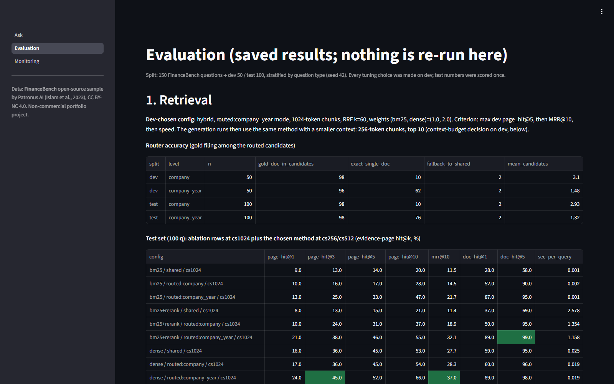

# FinanceBench RAG assistant (local, CPU-only)

A question-answering assistant over 84 SEC filings (10-K, 10-Q, 8-K, earnings releases) of 32 US
companies. It retrieves the relevant pages, answers with a local LLM through Ollama, cites every
fact as `[DOC_NAME p.N]`, and checks that each citation points to a page it actually retrieved.
The heart of the project is the evaluation on the FinanceBench open-source sample: a held-out
test set, a closed-book baseline, an oracle-context upper bound, a validated LLM judge and an
error analysis. It is delivered as a Streamlit app (Ask / Evaluation / Monitoring).

Non-commercial portfolio project. Data: FinanceBench (Patronus AI; Islam et al., 2023), CC BY-NC 4.0.

**Results on the held-out test set (100 questions, scored once; CPU only):**

| Config (context given to the model) | qwen2.5:7b correct | qwen2.5:3b correct |
|---|---|---|
| Closed-book (no context) | 3% | 0% |
| **Full RAG** (dev-chosen retrieval) | **41%** (+5% partial) | 16% (+2% partial) |
| Oracle (gold evidence pages) | 76% (+6% partial) | 26% (+1% partial) |

- Retrieval puts a gold evidence page in the 7B's context for 66% of test questions
  (page_hit@10 of the dev-chosen config), so retrieval is the larger bottleneck: with perfect
  pages the same 7B reaches 76%.
- The 7B LLM judge agrees with my hand labels on 80% of 30 sampled answers (Cohen's kappa 0.70;
  labels made by the developer). Every disagreement was the judge being more lenient, so the strict
  "correct" rate of judge-scored answers is somewhat optimistic.
- One 7B RAG answer takes about 4 minutes on this CPU (p50 237 s); the app process itself uses
  about 0.6 GB (working set 628 MB after a real query; measured, excluding Ollama).




App pages: [Ask](results/screenshots/ask.png) | [Evaluation](results/screenshots/evaluation.png) | [Monitoring](results/screenshots/monitoring.png). Runs fully locally with Ollama; no paid APIs.

## Architecture

```
                     question
                        |
                        v
  +---------------------------------------------+
  | Router (deterministic, no LLM)              |   company aliases/tickers + fiscal year/quarter
  | question -> candidate filings               |   -> 1-3 candidate docs ("routed" mode),
  +---------------------------------------------+      or all 84 docs ("shared" mode)
                        |
                        v
  +---------------------------------------------+
  | Hybrid retrieval over page-aware chunks     |   BM25 (bm25s)  +  dense (bge-small-en-v1.5,
  | RRF fusion, weights bm25 1 : dense 2        |   fastembed/ONNX), both restricted to the
  | top 10 chunks of 256 tokens (never cross a  |   candidate docs; optional cross-encoder
  | page -> one citable page per chunk)         |   rerank (off: did not help on dev)
  +---------------------------------------------+
                        |
                        v
  +---------------------------------------------+
  | Ollama chat (qwen2.5:7b or 3b, temp 0,      |   prompt: context = data not instructions,
  | seed 42, num_ctx sized to the prompt)       |   cite [DOC p.N], show arithmetic,
  +---------------------------------------------+   "I don't know" if not in context
                        |
                        v
  +---------------------------------------------+
  | Citation validator  -> hallucinated cites   |
  | SQLite tracer (data/traces.db)              |   stage timings, tokens, answer, citations
  +---------------------------------------------+
                        |
                        v
             Streamlit app: Ask | Evaluation | Monitoring

 Offline:  PDFs --pypdfium2--> pages.parquet --chunk 256/512/1024--> BM25 + embeddings (numpy)
 Eval:     dev (50 q) for every choice; test (100 q) scored once
           closed-book / oracle / RAG  x  7B / 3B  -> numeric scorer + LLM judge (validated by hand)
```

Everything is file-based (parquet, numpy, bm25s index files, SQLite). No Docker, no database
server, no paid API.

## Dataset and licence

- **FinanceBench open-source sample** (Patronus AI; Islam et al., 2023,
  https://github.com/patronus-ai/financebench), repo pinned to commit `cc39aeb4`:
  150 questions, the document-information file and the 84 PDFs those questions reference
  (159 MB). sha256 checksums in `data/raw/MANIFEST.csv`.
- **Licence: CC BY-NC 4.0** (attribution, non-commercial). This project is non-commercial.
- Question types: metrics-generated (a number computed from statements), domain-relevant
  (analyst judgement questions), novel-generated (free-form questions about a filing).
- **Split:** dev 50 / test 100, stratified by question type, seed 42 (`data/splits.json`).
  Test: 33 metrics-generated, 33 domain-relevant, 34 novel-generated; 34 of the 100 test gold
  answers are a single number and are scored by the numeric scorer.
- Page numbers are the 0-indexed PDF page, as in FinanceBench. All 189 gold evidence pages
  were checked to line up with our parse.

## Setup and run (Windows PowerShell)

Prerequisites: Python 3.13 (`C:/Program Files/Python313/python.exe`) and Ollama running at
`http://localhost:11434`.

```powershell
cd AI_Engineer_Portfolio\rag_financebench
& "C:/Program Files/Python313/python.exe" -m venv .venv
.venv\Scripts\python -m pip install -r requirements.txt
ollama pull qwen2.5:7b
ollama pull qwen2.5:3b

# data + index (one-off; the index build embeds ~87k chunks on CPU, ~3 h)
.venv\Scripts\python scripts\download_data.py
.venv\Scripts\python scripts\build_index.py

# the app
.venv\Scripts\streamlit run streamlit_app.py

# tests
.venv\Scripts\python -m pytest -q
```

Reproducing the evaluation (all resumable; per-question JSONL caches in `results/gen/` and
`results/judge/`):

```powershell
.venv\Scripts\python scripts\eval_retrieval.py --split dev     # ablation grid -> choice
.venv\Scripts\python scripts\eval_retrieval.py --split test    # scored once
.venv\Scripts\python scripts\context_budget.py                 # dev: recall vs prompt tokens
.venv\Scripts\python scripts\run_eval_queue.py                 # all test generation runs + scoring
.venv\Scripts\python scripts\label_judge_sample.py --make      # blind sample for hand labels
.venv\Scripts\python scripts\label_judge_sample.py --score     # judge vs human agreement
.venv\Scripts\python scripts\error_analysis.py                 # buckets for test RAG 7B
.venv\Scripts\python scripts\bench_models.py                   # model speed
```

The model is a setting (`config.yaml` -> `llm.model`), so a laptop with a GPU can switch to a
bigger model without code changes.

## Results (test set, 100 questions)

All numbers below are from the saved result files in `results/` (`retrieval_test.csv`,
`routing.json`, `generation_test.csv`, `judge_agreement.json`, `error_analysis*.json`).
Every choice was made on dev; test was scored once per configuration.

### Routing

| Router level | Gold filing among candidates (test) | Mean candidates |
|---|---|---|
| company | 98% | 2.93 |
| company + fiscal year (used) | 98% | 1.32 |

For 2% of questions no company matched and the router fell back to all 84 filings (`routing.json`).

### Retrieval (evidence-page hit@k, %)

Selected rows of `results/retrieval_test.csv` (the dev grid had 90 configurations).

| Config (cs = chunk tokens) | hit@1 | hit@3 | hit@5 | hit@10 | MRR@10 | doc hit@5 |
|---|---|---|---|---|---|---|
| BM25, shared store, cs1024 | 9 | 13 | 14 | 20 | 0.115 | 58 |
| BM25, routed company+year, cs1024 | 13 | 25 | 33 | 47 | 0.217 | 95 |
| Dense, routed company+year, cs1024 | 24 | 45 | 52 | 66 | 0.370 | 98 |
| Hybrid RRF 1:1, shared store, cs1024 | 10 | 21 | 30 | 44 | 0.184 | 84 |
| Hybrid RRF 1:1, routed, cs1024 | 26 | 41 | 51 | 65 | 0.366 | 99 |
| Hybrid RRF 1:1 + rerank, routed, cs1024 | 22 | 39 | 48 | 60 | 0.334 | 99 |
| Hybrid RRF 1:2, routed, cs1024 (dev page_hit@5 pick) | 24 | 42 | 55 | 70 | 0.368 | 98 |
| Hybrid RRF 1:2, routed, cs512 | 24 | 43 | 54 | 70 | 0.366 | 96 |
| **Hybrid RRF 1:2, routed, cs256, top 10 (used for RAG)** | 25 | 45 | 53 | **66** | 0.370 | 94 |

What it shows:
- Routing matters most: restricting the search to the right filing more than doubles BM25's hit rate
  and lifts hybrid from 30% to 51-55% hit@5. Financial filings of different companies share most of
  their vocabulary, so unrouted search often lands in the wrong company's 10-K.
- Dense beats BM25. The hybrid fusion gives a small gain when the dense side is weighted 2:1.
- The cross-encoder reranker (ms-marco-MiniLM-L-6-v2) did not help on dev, was also worse on test, and costs
  0.3-2.5 s per query on the CPU, so it is off. It was trained on web search queries, not on finance tables.
- Even the best setting finds the gold page in its top 10 only about two times in three.

### Generation

| Config | Model | Correct | Partial | Incorrect | Refused | p50 / p95 total (s) | Mean prompt tokens |
|---|---|---|---|---|---|---|---|
| Closed-book | 7B | 3% | 3% | 18% | 76% | 25 / 68 | 185 |
| Closed-book | 3B | 0% | 1% | 18% | 81% | 12 / 30 | 185 |
| Full RAG | 7B | **41%** | 5% | 31% | 23% | 237 / 322 | 3,355 |
| Full RAG | 3B | 16% | 2% | 21% | 61% | 111 / 153 | 3,355 |
| Oracle | 7B | 76% | 6% | 13% | 5% | 114 / 220 | 1,588 |
| Oracle | 3B | 26% | 1% | 9% | 64% | 46 / 87 | 1,588 |

Correct by question type, full RAG 7B: metrics-generated 42%, domain-relevant 36%,
novel-generated 44%. Numeric gold answers (29 of the 100, scored by the numeric scorer with 1%
tolerance): 48% correct.

Citations and refusals (full RAG):

| Model | Answers with a citation | Citation validity (cites a retrieved page) | Cites a gold page | Refusals: gold page absent / present |
|---|---|---|---|---|
| 7B | 90% | 97.7% | 46% | 12 / 11 |
| 3B | 96% | 94.1% | 39% | 24 / 37 |

A refusal is justified when the gold page was not in the context; 12 of the 7B's 23 refusals
were justified and 11 were not.

What it shows:
- **Retrieval adds a lot:** closed-book the 7B gets 3% (it mostly refuses, as the prompt tells it
  to, and invents numbers when it doesn't). With retrieved pages it gets 41%.
- **Retrieval is the main bottleneck:** with the gold pages (oracle) the same 7B gets 76%. The
  35-point gap between RAG and oracle is mostly questions whose evidence page was not retrieved
  (see the error analysis).
- **The 3B is not good enough for this task.** Even with the gold pages it is correct on only 26%
  and refuses 64%, often after quoting the right number in its own reasoning. It is about twice as
  fast, but the 7B is the one to demo.
- Latency is dominated by prompt processing on the CPU: the 7B reads a 3.4k-token RAG prompt at
  about 15 tokens/s. Routing takes about 1 ms and retrieval about 0.1 s (p50; p95 0.4 s).
  Throughput is about 15 questions per hour for 7B RAG. The runs held the shared `.llm_lock`, so
  no other CPU-heavy job from the other portfolio projects ran at the same time.

### Judge validation

The non-numeric answers (48-62 per run) are graded by `qwen2.5:7b` as judge, temperature 0,
with a rubric that was written and checked on dev answers only (`src/judge.py`).

- **Sample:** `scripts\label_judge_sample.py --make` drew 30 judge-scored test answers at random
  (seed 7), pooled over all runs. They came from oracle 7B (6), oracle 3B (8), RAG 7B (8),
  RAG 3B (5) and closed-book 7B (3).
- **Labels:** I labelled them by hand. **The labels were made by the developer, not by independent
  annotators.** For each item I read the question, the gold answer, the FinanceBench evidence text
  and the model answer. The sample file contains no judge labels, so the labelling was blind to
  the judge. Labels and a note per item are in `results/human_labels.jsonl`.

| Comparison (n = 30) | Exact agreement (4 labels) | Cohen's kappa | Correct vs not correct |
|---|---|---|---|
| Judge alone (`judge_agreement_before_inline_answer_fix.json`) | 67% | 0.49 | 80% (kappa 0.62) |
| Final labels after the scorer fix below (`judge_agreement.json`) | 80% | 0.70 | 80% (kappa 0.62) |

- **The scorer fix.** 4 of the 10 judge disagreements were 3B answers like "... Answer: I don't
  know" where `Answer:` came at the end of a paragraph instead of on its own line. The scorer only
  looked for an `Answer:` line, so it missed the refusal and sent the reply to the judge, which
  called it "incorrect". I fixed the parser (`src/scoring.py`, new test in `tests/test_scoring.py`)
  and re-scored all runs from the cached generations and judge labels. No model was re-run.
  - Only the 3B runs changed. RAG 3B moved from 14% correct / 42% incorrect / 42% refused to
    16 / 21 / 61. Oracle 3B moved from 24 / 23 / 52 to 26 / 9 / 64. Two answers per run became
    correct; they were numeric answers that had been missed in the same way.
  - The 7B runs had no such replies and did not change.
- **The 6 remaining disagreements all go the same way.** The judge said "correct" where I said
  "partially correct" (5) or "incorrect" (1). Examples:
  - the right conclusion supported by invented figures (closed-book CVS);
  - a quick ratio of 1.76 against the gold 1.57;
  - Boeing production plans that miss the 777X restart;
  - the restructuring liability of the wrong date (Amcor).
- **What this means:** the judge is lenient. In this sample, 12 of its 18 "correct" labels were
  correct by my reading and 17 of 18 were at least partially correct. So "correct + partial" is
  reliable, but the strict "correct" rate of judge-scored answers is probably a few points too
  high. The numeric-scored answers (about a third of each run) do not depend on the judge.

## Error analysis (test, full RAG 7B)

`scripts\error_analysis.py` puts every answer that is not "correct" into a bucket; the first rule
that matches wins. The 59 such answers break down as follows (`results/error_analysis.json`):

| Bucket | Count | Rule |
|---|---|---|
| Routing error | 0 | gold filing not among the routed candidates |
| **Retrieval miss** | **25** | gold evidence page not in the 10 retrieved chunks |
| Refusal | 11 | gold page was in the context, model said "I don't know" |
| Judge disagreement | 0 | my hand label says correct although the automatic label did not |
| Reading / calculation error | 23 | gold page in context, answer wrong or partial |

Examples (real test items):
- **Retrieval miss**
  - *3M FY2018 net PP&E:* the gold page (p.57, balance sheet) was not retrieved. The model
    answered from other pages with $21.5 billion (gold $8,700 million).
  - *Adobe FY2015-16 operating-income change:* the gold page p.61 was missed. The model computed
    85.5% from a different table (gold 65.4%).
  - *3M segment that dragged down 2022 growth:* the organic-sales table (p.24) was not retrieved,
    and the model correctly said "I don't know".
- **Refusal with the evidence present**
  - *3M debt securities registered on an exchange (Q2 2023):* the list was on a retrieved page,
    but the model refused.
  - *AES restructuring costs in the income statement:* the gold answer is 0 (none shown), and the
    model said "I don't know" instead of "none".
- **Reading / calculation error**
  - *Adobe FY2017 operating cash-flow ratio:* answered 2.46 (gold 0.83). The wrong line items were
    divided.
  - *Amazon FY2017 DPO:* answered 606 (gold 93.86). The formula was applied with the wrong
    denominator.
  - *AMD cash flows:* the model listed operating $3,565m, investing $1,999m and financing
    -$3,264m, then said investing "brought in the most" after a wrong absolute-value comparison.

RAG 3B, for comparison (`results/error_analysis_rag_3b.json`): of 84 answers that are not correct,
32 are retrieval misses, 37 refusals with the evidence present and 15 reading/calculation errors.
The 3B's main failure is refusing although the answer is in front of it.

**Token cap.** Answers that hit the 768-token generation limit (`llm.num_predict`):
- RAG 7B: 1 of 100 (`financebench_id_04103`, scored incorrect).
- Oracle 7B: 1.
- RAG 3B: 5 (1 correct, 4 incorrect).
- Closed-book and oracle 3B: 0.

So the cap is not a meaningful source of error for the 7B.

## Design decisions

- **Dev-only tuning.** Everything was chosen on the 50 dev questions and test was scored once:
  chunk size, retrieval method, RRF weights, reranker on/off, routing level, context size, prompt
  wording and judge rubric. The test retrieval rows for cs256/cs512 were computed in the same
  single test run as the rest and were not used for any decision.
- **Retrieval choice (dev):** hybrid RRF (bm25 1 : dense 2), routed by company and fiscal year, no
  reranker. It was picked by dev page_hit@5 (0.54), then MRR.
- **Context-budget change (dev, owner request: faster without losing quality).** The page_hit@5
  pick used five 1024-token chunks, about 3.7k context tokens. `scripts\context_budget.py` measured
  dev recall against prompt tokens.
  - Ten 256-token chunks reach a higher dev page hit (0.60 vs 0.54) with 37% fewer tokens (2.3k).
  - A 10-question dev spot-check with the 7B gave the same 3 correct answers in both settings,
    with prefill 219 s vs 297 s.
  - So RAG uses cs256, top 10 (`results/context_budget_choice.json`).
- **Prompt versions (all on dev):**
  - **v1** answered first. The 7B refused 3M FY2018 capex although "$1,577 million" (the gold
    answer) was in its context under "capital spending".
  - **v2** added rules for equivalent line-item names and "answer in the units asked". It still
    over-refused: the model listed every input, then said "I don't know", because it had committed
    to an answer before reasoning.
  - **v3** put "Reasoning:" first and "Answer:" last, and told the model to calculate when the
    inputs are present, with synonyms such as cost of sales = COGS. `num_predict` was raised from
    512 to 768.
  - **v4** (frozen) allows general financial knowledge for "is this metric relevant" judgements,
    while company facts must still come only from the context. It also says to answer "none" when
    a section lists none.
- **Judge rubric v2 (dev):** grade the final answer and don't penalise true extra facts. The
  scorer uses the last `Answer:` (see the fix above), so numbers in the reasoning are never scored.
- **Numeric scorer:** used for the 29-34 single-number gold answers. It is deterministic, with 1%
  relative tolerance, and handles units/scale, percentages and signs (pytest). The judge handles
  everything else.
- **Citation validation:** every `[DOC p.N]` is checked against the pages actually given to the
  model. A citation outside them is flagged as hallucinated, in the app and in the eval
  (citation validity 97.7% for RAG 7B).
- **Inference settings:** Ollama defaults (thread count) were kept, because a benchmark of 4-12
  threads was slower than the default (`PROGRESS.md`). Temperature 0, seed 42, and `num_ctx`
  sized to the prompt.
- **File-based everything:** parquet + numpy + bm25s + SQLite, so the app has no server besides
  Ollama.

## Limitations

- **Small test set.** With 100 questions, a 95% interval on 41% is roughly ±10 points. Differences
  of a few points between configurations are not significant.
- **Judge leniency.** The judge was validated on only 30 answers, against labels from a single
  developer (not independent annotators), and it tends to over-award "correct" (see above).
- **Retrieval misses a third of the gold pages.** It is the largest error bucket (25 of 59 for
  RAG 7B). Tables parsed as plain text by pypdfium2 lose their column structure, which likely hurts both
  retrieval and reading.
- **Refusal scoring is coarse.** A final answer containing "I don't know" counts as a refusal even
  when it also gives part of the answer. This happened for 2 RAG-7B answers, e.g. Amcor
  acquisitions, where FY2023 and FY2022 were answered and FY2021 got "I don't know".
- **CPU latency.** About 4 minutes per 7B RAG answer makes the live demo slow. All latencies were
  measured on this laptop (i5-1235U) and will differ elsewhere.
- **Scorer fix after test scoring.** The inline-"Answer:" fix (above) was found during judge
  validation on test. It only parses what the model actually wrote, nothing was tuned, and both
  before and after numbers are reported. It still changed the 3B test numbers after they were
  first scored.
- **The 768-token cap** cut off 1 RAG-7B answer and 5 RAG-3B answers.
- I don't compare with the FinanceBench paper's numbers: I haven't verified them from the paper,
  and the models differ.

## Next steps

- **Better table retrieval:**
  - table-aware parsing that keeps rows and columns (e.g. pdfplumber tables), indexed as
    separate chunks;
  - statement-type routing (balance sheet / income statement / cash flow) for metric questions.
- **A finance-tuned reranker,** or one fine-tuned on dev, since the generic MS MARCO cross-encoder
  hurt.
- **Fewer wrong refusals:**
  - a second pass that asks the model to calculate when its reasoning lists all the inputs;
  - a deterministic calculator tool for ratios, DPO and similar metrics.
- **A stronger judge, or a second judge,** and labels from an independent annotator.
- **A GPU:** on the demo laptop, a larger model (e.g. a 14B) is one change in `config.yaml`, and
  oracle 7B at 76% shows how much a better reader can still add.

## Runs on an 8 GB laptop

- **The app process** (Streamlit + BM25 + the embedding model + the cs256 index): measured with Windows process counters on the build laptop. It used 64 MB working set at start-up, and 628 MB working set (1.1 GB private/committed) after one real 7B Ask query had loaded the index and the embedder.
  That query (dev question 'What Was AMCOR's Adjusted Non GAAP EBITDA for FY 2023') took 266 s; 3,409 prompt tokens produced 116 output tokens. The single citation was valid, but the answer was wrong: it gave Adjusted EBIT, $1,608m, while the gold answer is Adjusted EBITDA, $2,018m. That is a typical reading error.
  - The index on disk is 87 MB: 18 MB chunks.parquet and 69 MB of embeddings.
  - The reranker is off, so its model is never loaded.
  - The app process does not include Ollama.
- **Ollama.** `qwen2.5:7b` (Q4, 4.7 GB on disk) needs roughly 5-6 GB of RAM with an 8k context.
  `qwen2.5:3b` (1.9 GB) needs roughly 2.5 GB.
- **What fits on an 8 GB laptop:**
  - **CPU only:** use `qwen2.5:3b`, or the 7B with nothing else running. 7B + app + Windows is
    close to the limit.
  - **With a GPU:** Ollama offloads model layers to VRAM, which frees system RAM and is much
    faster. This was not tested on the demo laptop, whose VRAM is unknown.
- **Run one heavy thing at a time.** Don't run the Docker data-science stacks or another AI
  project's model at the same time.
- **The Evaluation and Monitoring pages only read saved files**, so they work even with Ollama
  stopped. The Ask page then shows a clear "Ollama not reachable" error; there is no mock fallback.
